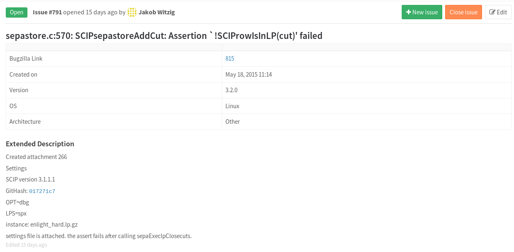

[](http://badge.fury.io/py/bugzilla2gitlab) [](https://travis-ci.org/xmunoz/bugzilla2gitlab)

# bugzilla2gitlab

- [Introduction](#introduction)
- [Installation](#installation)
- [Usage](#usage)
- [How it works](#how-it-works)
- [Caveats](#caveats)
- [Demo](#demo)
- [Contributing](#contributing)

## Introduction

This is a tool for developers or admins who want to migrate the issue management for their software project from Bugzilla to Gitlab Issues. Here is a screenshoot of an issue created by bugzilla2gitlab:


bugzilla2gitlab copies over bugs, bug comments and attachments.

## Installation

This library is very much under development. That said, if you like to feel the wind in your hair, simply `pip install bugzilla2gitlab`.

More than likely, you will need to roll up your sleaves and hack on the package to achieve a migration that you are happy with. In this case:

```
git clone git@github.com:xmunoz/bugzilla2gitlab.git
cd bugzilla2gitlab
virtualenv venv
source venv/bin/activate
pip install -r requirements.txt
# installs this package locally
pip install .
```

bugzilla2gitlab is compatible with python2.7, 3.3, 3.4, 3.5 and 3.6.

## Usage

bugzilla2gitlab synchronously migrates a user-defined list of bugzilla bugs to a single GitLab project. There are two interfaces for this library. The command line usage:

```
$  bin/bugzilla2gitlab -h
usage: bugzilla2gitlab [-h] [FILE] [CONFIG_DIRECTORY]

Migrate bugs from Bugzilla to GitLab Issues.

positional arguments:
  [FILE]              A file containing a list of Bugzilla bug numbers to
                      migrate, one per line.
  [CONFIG_DIRECTORY]  The directory containing the required configuration
                      files.

optional arguments:
  -h, --help          show this help message and exit
```

This package can also be used as a python module.

```
from bugzilla2gitlab import Migrator

client = Migrator(config_path="/path/to/config")
bugs_list = [1,2,3,4,5,6,7]
client.migrate(bugs_list)
```

## Configuration

To begin using bugzilla2gitlab, the following list of configuration files is required in the specified `config` directory:

- `defaults.yml`: Core default values used throughout the modules.
- `user_mappings.yml`: key, value pairs of Bugzilla usernames to GitLab users
- `component_mappings.yml`: key, value pairs of Bugzilla components to Gitlab labels

Samples of all of these files with documentation for each configuration variable can be found in `tests/test_data/config`.

bugzilla2gitlab creates issues and comments in GitLab with the user accounts specified in `user_mappings.yml`, perserving the integrity of the original Bugzilla commenter. This, however, may not always be possible. In [tests/test_data/config/user_mappings.yml](tests/test_data/config/user_mappings.yml), users with the designation "bugzilla" may have left the organization and therefore not have current GitLab accounts, or might simply be machine users. Comments for such users will be left under a generic "bugzilla" account. bugzilla2gitlab doesn't create any new user accounts. All of the accounts specified in `user_mappings.yml` must already exist in your GitLab installation.

The default table created in the issue description by bugzilla2gitlab looks like this:

|  |  |
| --- | --- |
| Bugzilla Link | [570755](https://bugzilla.mozilla.org/show_bug.cgi?id=570755) |
| Created on | Jun 08, 2010 10:25 |
| Version | unspecified |
| OS | All |
| Architecture | All |
| Attachments | [a_PHP_play_script_to_demonstrate_how_the_browser_requests_videos](/uploads/e521dd042dc4cfd3d49151d87dee8058/a_PHP_play_script_to_demonstrate_how_the_browser_requests_videos) |
| Reporter | mozilla |

To modify this table, take a look at `create_description` in [models.py](/bugzilla2gitlab/models.py#L92).

## How it works

### GitLab

Gitlab has a comprehensive and extensively documented API. Here are the main endpoints that this library makes use of.

- [Creating new issues](http://doc.gitlab.com/ce/api/issues.html#new-issue)
- [Adding comments to issues](http://doc.gitlab.com/ce/api/notes.html)
- [Uploading files](http://doc.gitlab.com/ce/api/projects.html#upload-a-file)
- [Changing an issue status](http://doc.gitlab.com/ce/api/issues.html#edit-issue)
- [Getting user ids](http://doc.gitlab.com/ce/api/users.html#for-admins)

Calls to the Gitlab API must be made with an administrator private token in order to [impersonate other users](http://doc.gitlab.com/ce/api/#sudo).

### Bugzilla

This program relies on being able to fetch bug data by simply appending `&ctype=xml` to the end of the bugzilla bug url, and then parsing the resultant xml. If this trick doesn't work on your bugzilla installation, then bugzilla2gitlab probably won't work for you.

## Caveats

Every comment or mention in GitLab typically sends a notification. This is true even for comments/issues created programatically. To avoid users inboxes being flooded with meaningless email notifications and avoid overwhelming your SMTP servers, GitLab users should disable all email notifications (global and group-specific) just prior to the running of this script. This can be done through the [gitlab UI](https://gitlab.com/profile/notifications).

Further, this tools requires Gitlab [sudo](https://docs.gitlab.com/ce/api/#sudo). If you need a tool that works without sudo, take a look at [FreeDesktop's migration tool](https://gitlab.freedesktop.org/freedesktop/bztogl).

## Demo

If you want to test out this library on a non-production GitLab instance, I recommend starting up a [one-click GitLab droplet from DigitalOcean](https://www.digitalocean.com/features/one-click-apps/gitlab/). From there, you can create a code repository, add some user accounts, and take bugzilla2gitlab for a spin.

## Contributing

Check out [CONTRIBUTING.md](CONTRIBUTING.md).
